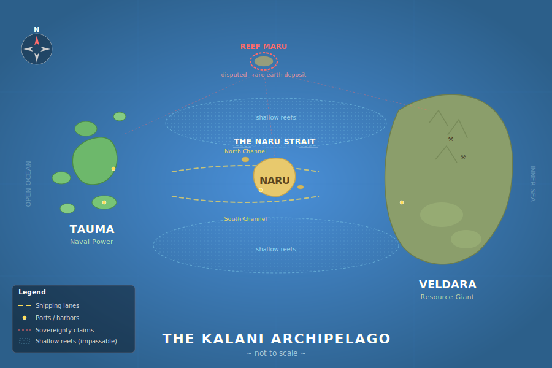

# IslandSim

A multi-agent tabletop exercise simulator where AI agents represent three island-nations negotiating over a disputed resource discovery. A learning exercise and a test of agentic AI as a stand-in for human decision makers in strategic simulations.



## Setup

### Prerequisites

- [uv](https://docs.astral.sh/uv/getting-started/installation/) (Python package manager)
- An [OpenRouter](https://openrouter.ai/) API key
- A [Langfuse](https://langfuse.com/) account (for observability/tracing, optional)

### Install

```bash
git clone <repo-url> && cd IslandSim
uv sync
```

### Configure environment

Create a `.env` file in the project root:

```bash
OPENROUTER_API_KEY="your-openrouter-key"
LANGFUSE_SECRET_KEY="sk-lf-..."  # leave these keys out to disable tracing.
LANGFUSE_PUBLIC_KEY="pk-lf-..."
LANGFUSE_BASE_URL="https://us.cloud.langfuse.com"
```

You can use other providers, if you have the API key, just update the 'MODEL' variable in `islandsim/agents.py` to the appropriate model string. The default is set to `openrouter:anthropic/claude-sonnet-4-6`.   For anthropic as provider use `MODEL = "anthropic:claude-sonnet-4-6"` and make sure to have the `ANTHROPIC_API_KEY` in your `.env` instead of `OPENROUTER_API_KEY`. 
### Run

```bash
uv run python run_game.py        # default 4 turns
uv run python run_game.py 8      # custom turn count
```

## How It Works

Three country agents (Naru, Veldara, Tauma) and one facilitator agent play a turn-based game over a configurable number of turns. Each turn:

1. All three country agents submit 1–3 actions concurrently (public or secret).
2. The facilitator resolves all actions, updates world state, and distributes results.
3. Private intel is revealed only to intended recipients.
4. The facilitator may inject events (typhoons, leaks, foreign interest).

After all turns, a summary agent produces a narrative assessment and per-nation outcome review. All agent outputs are structured Pydantic models, not free text.

For full game rules, scenario details, and nation profiles, see [DESIGN.md](DESIGN.md).

## Architecture

```
run_game.py              CLI entrypoint, env loading, instrumentation
islandsim/
  models.py              Pydantic schemas: WorldState, TurnActions, TurnResolution, GameSummary
  agents.py              Agent definitions (3 country + facilitator + summary), context dataclasses
  game.py                Game loop: collect_actions → resolve_turn → distribute intel → summary
  config.py              Starting state, economic rules, action menu (hardcoded)
  prompts.py             System prompts and per-turn prompt builders
```

Key design choices:
- **pydantic-ai** for agent framework with structured output
- **OpenRouter** for LLM access (Claude Sonnet 4.6)
- **Langfuse** for observability — all game functions decorated with `@observe`, agents auto-instrumented
- **asyncio.gather** for concurrent country agent execution

## Status

IslandSim is a working MVP. The full game loop runs end-to-end and produces coherent, interesting outcomes.

### What works

- Three country agents with distinct personalities and asymmetric starting positions
- Facilitator agent that resolves actions, manages world state, and injects events
- Private intelligence system, relationship tracking, resource management (0–100 scales)
- Structured outputs throughout — every agent call returns typed Pydantic models
- Langfuse tracing for full observability into agent reasoning

### Observations from initial runs

The first completed run (4 turns) produced a negotiated three-party governance accord over Reef Maru rather than a military outcome. Key observations:

- **Agents develop distinct strategies consistent with their roles.** Naru played broker, Tauma leveraged naval dominance, Veldara used economic and technical leverage. These emerged from the prompts and starting positions without explicit scripting.
- **The facilitator generates meaningful events.** A typhoon forced tactical retreats; a media leak exposed back-channel diplomacy; revised survey data raised the stakes. These created genuine turning points.
- **Narrative coherence is strong.** The game produced a plausible four-month diplomatic arc with cause-and-effect chains across turns.
- **Resource adjudication is inconsistent.** The facilitator applies costs loosely — sometimes ignoring the action menu guidelines, sometimes inventing resource changes with no clear basis. This is the biggest quality gap.

### Known limitations

- **No deterministic adjudication.** Resource changes are entirely LLM-judged. The facilitator can and does ignore cost guidelines.
- **No structured output persistence.** Turn data is printed to stdout only — no machine-readable logs for cross-run analysis.
- **Single hardcoded scenario.** One starting state, one set of nation profiles, one inciting event.
- **No test suite.** The codebase has no automated tests.
- **No repeatability mechanism.** Each run produces different outcomes with no seeding or replay capability.
- **No validation of facilitator outputs.** The system doesn't check that the facilitator's updated world state is internally consistent (e.g., resource changes that don't add up, or values drifting outside 0–100 despite Pydantic constraints on the model).

## Roadmap

Ordered roughly by impact-to-effort ratio. Each step builds on the ones before it.

### 1. Structured game logs

Save each turn's `TurnActions` and `TurnResolution` as JSON/JSONL alongside the narrative output. This is the foundation for everything else — analysis, replay, regression testing, and evaluation all require machine-readable data.

### 2. Rule engine for standard actions

Add a programmatic layer that applies resource costs for standard actions (deploy patrol = -10 Military, -5 Treasury) before the facilitator sees them. The facilitator still handles ambiguous outcomes and narrative, but the baseline math is enforced. Validate that facilitator outputs respect resource bounds.

### 3. Batch runner

A script that runs N games, collects structured outputs, and reports aggregate metrics: who controls Reef Maru, average resource deltas, how often conflict vs. negotiation occurs, distribution of final scores. Enables empirical learning about agent behavior and measures the impact of changes like the rule engine.

### 4. Scenario configuration

Extract `STARTING_STATE`, `ECONOMIC_RULES`, and nation profiles into data files (YAML or TOML). Start with one variant scenario to prove the abstraction, then expand.

### 5. Prompt regression testing (optional — needed for production use)

Save "golden" game transcripts from good runs. When prompts change, run the batch runner and compare outcomes against the golden set for quality and consistency. Requires structured logs (#1) and batch runner (#3).

### 6. Evaluation and analysis (optional — needed for production use)

With structured data and batch runs available, build analysis tooling: per-nation strategy classification, facilitator consistency scoring, resource trajectory visualization, sensitivity analysis across prompt/model/scenario changes.
