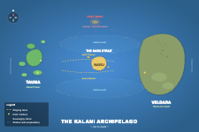

## Three island tabletop exercise

This is a learning exercise as well as a test of the ability of Agentic AI to serve as models of decision makers in a tabletop exercise.

## setup

- Requires uv
- Requires environment variables in env or otherwise:
OPENROUTER_API_KEY

## Planning documents

### The situation
Three island-nations face a crisis that forces negotiation, posturing, and strategic decision-making over multiple turns. A Facilitator agent (referee/GM) interprets actions, resolves outcomes using lightweight game rules + a simple simulation model + common sense, and injects events to keep things interesting.

Three island-nations in a temperate sea, historically independent, loosely connected by trade. The geography is roughly linear, west to east:

**Layout (west → east):**

Tauma sits in the open ocean to the west — a scattered chain of smaller islands with deep harbors. Naru is a single small island in the center. Veldara, the largest island, lies to the east. Between them, bands of shallow reef and rocky shoals make most of the water impassable to large vessels. The only safe shipping lanes are the two deep-water channels that pass on either side of Naru — the **North Channel** and the **South Channel**, collectively known as the **Naru Strait**. Any ship moving between Tauma and Veldara (or between the archipelago and the open ocean) must pass through one of these channels, right under Naru's nose.

To the north, roughly equidistant from all three nations, lies **Reef Maru** — a small uninhabited atoll in waters where all three sovereignty claims overlap.

### Naru (The Strait Power)

- **Geography:** A single small island sitting between the two navigable channels. Limited farmland — mostly rocky with a port town and coast guard installations. Controls passage through the strait by geography alone.
- **Strengths:** Strategic chokepoint, strong coast guard/navy relative to size, toll revenue from shipping.
- **Weaknesses:** Food-dependent on imports, small population, economy collapses if trade stops.
- **Personality:** Pragmatic, transactional. Historically neutral. Sees the strait as both its greatest asset and greatest vulnerability.

### Veldara (The Resource Giant)

- **Geography:** Largest island, to the east. Mountainous interior with rich mineral deposits (rare earth metals critical for tech manufacturing), fertile lowland farmland, one major west-facing port.
- **Strengths:** Resource wealth, food self-sufficiency, largest population.
- **Weaknesses:** Underdeveloped navy, mining regions are inland and need port access through Naru-controlled waters to reach export markets, internal political tension between mining interests and farming communities.
- **Personality:** Confident, sometimes overreaching. Sees itself as the natural regional leader.

### Tauma (The Naval Power)

- **Geography:** An archipelago-within-the-archipelago — a chain of smaller islands scattered across the open ocean to the west. Deep natural harbors, fishing economy, strong maritime tradition.
- **Strengths:** Best navy in the region, skilled shipbuilders, controls key fishing grounds.
- **Weaknesses:** Limited natural resources beyond fish, no rare earths, rocky soil makes farming difficult. Depends on Veldara for minerals and manufactured goods — all of which must transit through the Naru Strait.
- **Personality:** Proud, independent, suspicious of Veldara's ambitions. Historical rivalry.

---

## The Inciting Event

A massive deposit of rare earth minerals is discovered on **Reef Maru**, a small uninhabited atoll in disputed waters between all three nations. The deposit is estimated to be worth more than Veldara's entire existing reserves. All three nations have plausible (but contested) sovereignty claims.

Simultaneously, a typhoon season is forecast to be unusually severe, threatening shipping routes and food supplies.

---

## Resource System

Each nation tracks **four resources** on a 0–100 scale:

| Resource | Description |
| --- | --- |
| **Military Readiness** | Naval strength, troop readiness, defensive posture. Deploying forces costs readiness; it recovers slowly. |
| **Treasury** | Wealth available for spending — trade deals, bribes, infrastructure, military ops. Income from trade/tolls each turn. |
| **Food Supply** | Stockpiles + production. Drops if trade is disrupted. Below 20 = domestic unrest. Below 10 = crisis. |
| **Public Support** | Domestic approval. Affected by perceived strength, economic conditions, and whether leaders seem competent. Below 25 = government instability. |

### Starting Values

|  | Military | Treasury | Food | Support |
| --- | --- | --- | --- | --- |
| **Naru** | 45 | 70 | 30 | 60 |
| **Veldara** | 30 | 55 | 75 | 50 |
| **Tauma** | 65 | 40 | 35 | 55 |

These encode the asymmetries: Naru is rich but food-insecure, Veldara is resource-rich but militarily weak, Tauma is militarily strong but poor.

---

## Turn Structure

Each game turn represents roughly **one month**. A full game runs **6–10 turns**.

**Each turn:**

1. **Facilitator** announces the current world state (resource levels, any events, public information).
2. **Each country agent** submits actions (1–3 actions per turn). Actions can be public (announced to all) or secret (revealed only if detected or relevant).
3. **Facilitator** resolves all actions simultaneously:
    - Applies resource costs/gains from the rules framework.
    - Uses judgment for ambiguous outcomes ("Veldara tries to secretly negotiate with Naru — does Tauma's intelligence network detect it?").
    - Rolls for uncertain outcomes where appropriate (probability-weighted, not pure dice).
    - Announces results to each country (some public, some private).
4. **Facilitator** may inject an **event** (typhoon hits, pirate activity, a journalist leaks a secret deal, a foreign power expresses interest in the region).
5. Repeat.

---

## Action Menu (non-exhaustive)

Countries can attempt anything plausible, but here are common actions with rough costs:

**Military**

- Deploy naval patrol to Reef Maru: -10 Military, -5 Treasury
- Establish military base on the reef: -20 Military, -15 Treasury (takes 2 turns)
- Naval blockade of a strait or port: -15 Military/turn, diplomatic fallout
- Defensive posture (fortify home waters): -5 Military, +5 Support

**Economic**

- Propose trade deal (bilateral): variable Treasury, negotiated terms
- Impose trade sanctions: -5 Treasury (lost trade), target loses more
- Invest in infrastructure: -15 Treasury now, +income in future turns
- Economic aid to another nation: -10 Treasury, +10 target's Support toward you

**Diplomatic**

- Public declaration of sovereignty over Reef Maru: +5 Support domestically, -relations with others
- Propose joint development agreement: requires negotiation
- Secret back-channel negotiation: risk of detection
- Appeal to international community: slow but legitimizing, +5 Support
- Espionage: -5 Treasury, chance of discovering secrets, chance of getting caught

**Domestic**

- Ration food supplies: slows Food decline, -5 Support
- Propaganda campaign: -5 Treasury, +10 Support (diminishing returns)
- Emergency food imports: -15 Treasury, +15 Food (if trade routes open)

---

## Facilitator Rules of Thumb

The Facilitator uses the resource costs above as guidelines, not absolute rules. The Facilitator should:

- **Apply the numbers** for straightforward actions (deploying ships costs readiness).
- **Use judgment** for outcomes that depend on context (does the secret deal get leaked? depends on how careful they were, whether the other side has invested in espionage, etc.).
- **Model second-order effects** (a blockade doesn't just cost Military — it disrupts trade, which hits Treasury and Food for everyone who uses that route).
- **Maintain a simple economic model**: each turn, nations gain Treasury from their economic base (Naru: +10 from tolls if strait is open; Veldara: +8 from mining exports; Tauma: +5 from fishing). Food production: Naru +3, Veldara +8, Tauma +5. Food consumption is ~5/turn for all.
- **Track relationships** as a simple sentiment score between each pair of nations.
- **Inject events** roughly every 2–3 turns to prevent stalemate and test adaptability.

---

## Victory Conditions (Soft)

There's no single winner. At game end, evaluate each nation on:

- **Sovereignty outcome**: Who controls or shares Reef Maru?
- **Resource position**: Are they better or worse off than they started?
- **Stability**: Is public support above critical thresholds?
- **Alliances**: Have they built durable partnerships or burned bridges?

The Facilitator provides a narrative summary and assessment at game end.

### MVP 
**Start here:**

1. Hardcode the world state and rules as a JSON config + rules document.
2. Implement the Facilitator as a single LLM call per resolution phase (full world state + actions in, updated state + narrative out).
3. Implement country agents as simple LLM calls (state + history in, actions out).
4. Run 3–4 turns manually, inspect the logs.
5. Evaluate: Are the agents making interesting decisions? Is the Facilitator applying rules consistently? Are the numbers adding the right amount of constraint without dominating?