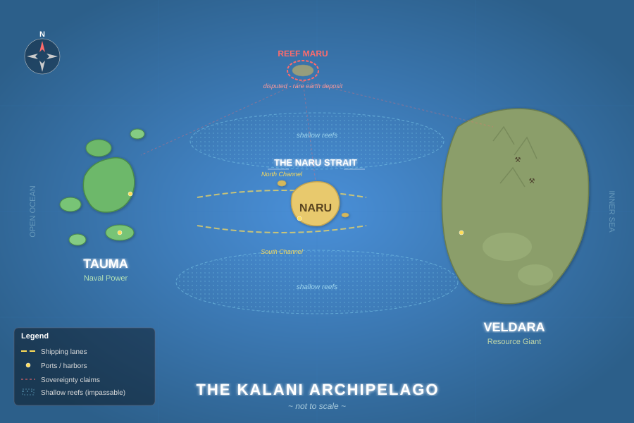

# IslandSim

A multi-agent tabletop exercise simulator where AI agents represent three island-nations negotiating over a disputed resource discovery. A learning exercise and a test of agentic AI as a stand-in for human decision makers in strategic simulations.



## Setup

### Prerequisites

- [uv](https://docs.astral.sh/uv/getting-started/installation/) (Python package manager)
- An [OpenRouter](https://openrouter.ai/) API key
- A [Langfuse](https://langfuse.com/) account (for observability/tracing, optional)

### Install

```bash
git clone <repo-url> && cd IslandSim
uv sync
```

### Configure environment

Create a `.env` file in the project root:

```bash
OPENROUTER_API_KEY="your-openrouter-key"
LANGFUSE_SECRET_KEY="sk-lf-..."  # leave these keys out to disable tracing.
LANGFUSE_PUBLIC_KEY="pk-lf-..."
LANGFUSE_BASE_URL="https://us.cloud.langfuse.com"
```

You can use other providers, if you have the API key, just update the 'MODEL' variable in `islandsim/agents.py` to the appropriate model string. The default is set to `openrouter:anthropic/claude-sonnet-4-6`.   For anthropic as provider use `MODEL = "anthropic:claude-sonnet-4-6"` and make sure to have the `ANTHROPIC_API_KEY` in your `.env` instead of `OPENROUTER_API_KEY`. 

### Run

```bash
uv run python run_game.py                          # default scenario (reef_maru), 4 turns
uv run python run_game.py 8                         # custom turn count
uv run python run_game.py --scenario south_china_sea  # variant scenario
uv run python run_game.py 2 --scenario reef_maru    # quick 2-turn test
uv run python run_game.py --play naru              # play as Naru in the TUI (AI runs the other two)
uv run python run_game.py 6 --play veldara --scenario south_china_sea  # custom human game
```

### Playing as a human (TUI)

Use `--play <nation>` to take control of one nation while the other two remain AI-driven. Valid values are `naru`, `veldara`, or `tauma`. The interface is a full-screen [Textual](https://textual.textualize.io/) TUI — make sure your terminal window is reasonably large (roughly 140×40 or more) or things will wrap.

One long-lived `GameApp` owns the whole session, rotating between four screens:

1. **Briefing** — your resources, other nations, pairwise relationships, world status (Reef Maru, Naru Strait, active effects), plus a History / Private Intel tab. The action panel on the right has four category buttons (Military / Economic / Diplomatic / Domestic), a filtered list of actions with cost + affordability indicators, and a queue of the 1–3 actions you're building. Focus starts on the action list so arrow keys + Enter work immediately.
2. **Action modal** — pops when you pick an action: pre-filled description you can edit (e.g. rewrite "Propaganda campaign" as "Propaganda campaign blaming Veldara for Reef Maru tensions"), visibility (Public/Secret), and a target nation when applicable. "Custom…" opens a free-text variant with no pre-fill.
3. **Waiting** — shown while the AI country agents finish (they run concurrently during your briefing) and the facilitator resolves the turn. Facilitator calls usually take 20–40 s.
4. **Resolution** — narrative of what happened, any world event injection, your resource delta table (before / after / change), and new private intel. Press Enter or click Continue to advance.

After the last turn, a final **Summary** screen shows the `GameSummary` narrative, Reef Maru outcome, and per-nation assessments. The structured `GameLog` is saved to `logs/` as with any AI-only run.

Notes:

- Affordability is indicated (✓/✗) but doesn't block; the rule engine is still the source of truth for costs and bounds.
- If you don't see keyboard focus where you expect, Tab cycles through widgets on the current screen.

### Configuration

**Scenarios** are defined in `scenarios/*.yaml`. Each file specifies nation profiles, starting resources, economic parameters, relationships, action costs, and narrative context.

**Operational config** (`config.yaml` at project root, optional) controls model selection, retries, and default turns:

```yaml
models:
  country: "openrouter:anthropic/claude-haiku-4.5"
  facilitator: "openrouter:anthropic/claude-sonnet-4-6"
retries: 2
default_turns: 4
```

To test with cheaper models or fewer turns, edit `config.yaml` — no code changes needed.

## How It Works

Three country agents (Naru, Veldara, Tauma) and one facilitator agent play a turn-based game over a configurable number of turns. Each turn:

1. All three country agents submit 1–3 actions concurrently (public or secret). Each action is classified as a standard type (via `StandardActionType` enum) or custom (`None`).
2. A rule engine applies deterministic per-turn economic adjustments (income, food, threshold penalties) and pre-deducts resource costs for standard actions.
3. The facilitator resolves all actions — pre-applied costs are communicated so they aren't double-counted. The facilitator handles narrative, ambiguous outcomes, custom action costs, and event injection.
4. The rule engine validates the facilitator's output, ensuring pre-applied costs are respected.
5. Private intel is revealed only to intended recipients.

After all turns, a summary agent produces a narrative assessment and per-nation outcome review. All agent outputs are structured Pydantic models, not free text.

For full game rules, scenario details, and nation profiles, see [DESIGN.md](DESIGN.md).

## Architecture

```
run_game.py              CLI entrypoint, env loading, instrumentation, log saving
scenarios/
  reef_maru.yaml         Default scenario (Kalani Archipelago crisis)
  south_china_sea.yaml   Variant scenario (Jade Shoal standoff)
config.yaml              Operational config: models, retries, default turns (optional)
islandsim/
  models.py              Pydantic schemas: WorldState, TurnActions, Action, StandardActionType, TurnResolution, GameSummary, etc.
  scenario.py            Scenario config models, YAML loader, auto-generated prompt text
  settings.py            Operational config model and loader
  agents.py              Agent factory, context dataclasses
  game.py                Game loop: collect_actions → rule engine → resolve_turn → validate → summary
  rules.py               Rule engine: economic adjustments, standard action costs, output validation
  prompts.py             System prompt builders and per-turn prompt builders
logs/                    Structured JSON game logs (one per run, gitignored)
```

Key design choices:

- **YAML scenario files** for all game-specific configuration — nations, economics, action costs, narrative context
- **Separate operational config** (`config.yaml`) for model selection and runtime settings — swap models for regression testing without touching scenarios
- **pydantic-ai** for agent framework with structured output
- **Rule engine** for deterministic resource math — standard action costs enforced programmatically via `StandardActionType` enum on `Action`, with facilitator output validation
- **Auto-generated prompt text** — economic rules and action menu text rendered from scenario data, preventing drift between what agents are told and what the engine enforces
- **Langfuse** for observability — all game functions decorated with `@observe`, agents auto-instrumented
- **asyncio.gather** for concurrent country agent execution

## Status

IslandSim is a working MVP. The full game loop runs end-to-end and produces coherent, interesting outcomes.

### What works

- Three country agents with distinct personalities and asymmetric starting positions
- Facilitator agent that resolves actions, manages world state, and injects events
- Private intelligence system, relationship tracking, resource management (0–100 scales)
- Structured outputs throughout — every agent call returns typed Pydantic models
- Structured game logs — each run saves a complete JSON log to `logs/` with initial state, per-turn actions/resolutions, and final summary
- Langfuse tracing for full observability into agent reasoning

### Observations from initial runs

The first completed run (4 turns) produced a negotiated three-party governance accord over Reef Maru rather than a military outcome. Key observations:

- **Agents develop distinct strategies consistent with their roles.** Naru played broker, Tauma leveraged naval dominance, Veldara used economic and technical leverage. These emerged from the prompts and starting positions without explicit scripting.
- **The facilitator generates meaningful events.** A typhoon forced tactical retreats; a media leak exposed back-channel diplomacy; revised survey data raised the stakes. These created genuine turning points.
- **Narrative coherence is strong.** The game produced a plausible four-month diplomatic arc with cause-and-effect chains across turns.
- ~~**Resource adjudication is inconsistent.** The facilitator applies costs loosely — sometimes ignoring the action menu guidelines, sometimes inventing resource changes with no clear basis. This is the biggest quality gap.~~ Resolved — a rule engine now enforces standard action costs and per-turn economic adjustments deterministically.

### Known limitations

- ~~**No deterministic adjudication.** Resource changes are entirely LLM-judged. The facilitator can and does ignore cost guidelines.~~ Resolved — rule engine enforces standard action costs and validates facilitator output.
- ~~**No structured output persistence.** Turn data is printed to stdout only — no machine-readable logs for cross-run analysis.~~ Resolved — structured game logs now saved to `logs/`.
- ~~**Single hardcoded scenario.** One starting state, one set of nation profiles, one inciting event.~~ Resolved — scenarios now loaded from YAML files with a `--scenario` flag.
- **No test suite.** The codebase has no automated tests.
- **No repeatability mechanism.** Each run produces different outcomes with no seeding or replay capability.
- ~~**No validation of facilitator outputs.** The system doesn't check that the facilitator's updated world state is internally consistent (e.g., resource changes that don't add up, or values drifting outside 0–100 despite Pydantic constraints on the model).~~ Resolved — rule engine validates and corrects facilitator output.
- **TUI report panels don't scroll.** The narrative / event / intel panels on the ResolutionScreen and SummaryScreen are wrapped in a `VerticalScroll`, but when content is taller than the viewport it gets clipped instead of scrolling. Likely a sizing / focus issue with the inner `Container(classes="panel")` inside the scroll region — fix before the next round of TUI polish.

## Roadmap

Ordered roughly by impact-to-effort ratio. Each step builds on the ones before it.

### 1. Structured game logs

Save each turn's `TurnActions` and `TurnResolution` as JSON/JSONL alongside the narrative output. This is the foundation for everything else — analysis, replay, regression testing, and evaluation all require machine-readable data. [IMPLEMENTED 3/25/26]

### 2. Rule engine for standard actions

Add a programmatic layer that applies resource costs for standard actions (deploy patrol = -10 Military, -5 Treasury) before the facilitator sees them. The facilitator still handles ambiguous outcomes and narrative, but the baseline math is enforced. Validate that facilitator outputs respect resource bounds. [IMPLEMENTED 3/30/26]

### 3. Scenario configuration

Extract `STARTING_STATE`, `ECONOMIC_RULES`, and nation profiles into data files (YAML or TOML). Start with one variant scenario to prove the abstraction, then expand. [IMPLEMENTED 4/14/26]

### 4. Human plays one nation (TUI)

Add a playable interface where a human controls one nation while the other two remain AI-driven. Human input produces the same `TurnActions` model as AI agents, so the rule engine, facilitator, validation, and structured logs stay unchanged. [IMPLEMENTED 4/20/26] — shipped as a Textual TUI (`--play <nation>`) driven by a long-lived `GameApp` with Briefing / Waiting / Resolution / Summary screens. AI country agents run as background tasks during the briefing so the human isn't blocked and their failures can't cancel the briefing.

**Next time on the TUI**: fix scrolling in the report panels — the narrative / event / intel panels on the ResolutionScreen (and the per-nation panels on the SummaryScreen) currently clip instead of scrolling when content overflows.   And refactor to make sure DRY is respected.

### 4.5 save game 

This might require a file that saves the current game state after each turn for the CLI to read from and update? 

### 5. Batch runner

A script that runs N games, collects structured outputs, and reports aggregate metrics: who controls Reef Maru, average resource deltas, how often conflict vs. negotiation occurs, distribution of final scores. Enables empirical learning about agent behavior and measures the impact of changes like scenarios, prompts, and the rule engine.

### 6. Evaluation 

Develop some kind of evaluation for comparing the next phase to work. Per-nation strategy classification, facilitator consistency scoring, resource trajectory visualization.

### 7. Test different models / prompts and scenarios

Mostly interested in testing vs local models or other small models for nations for speed

### 8.  Report?
Include "Golden" game transcripts form good runs.

 
