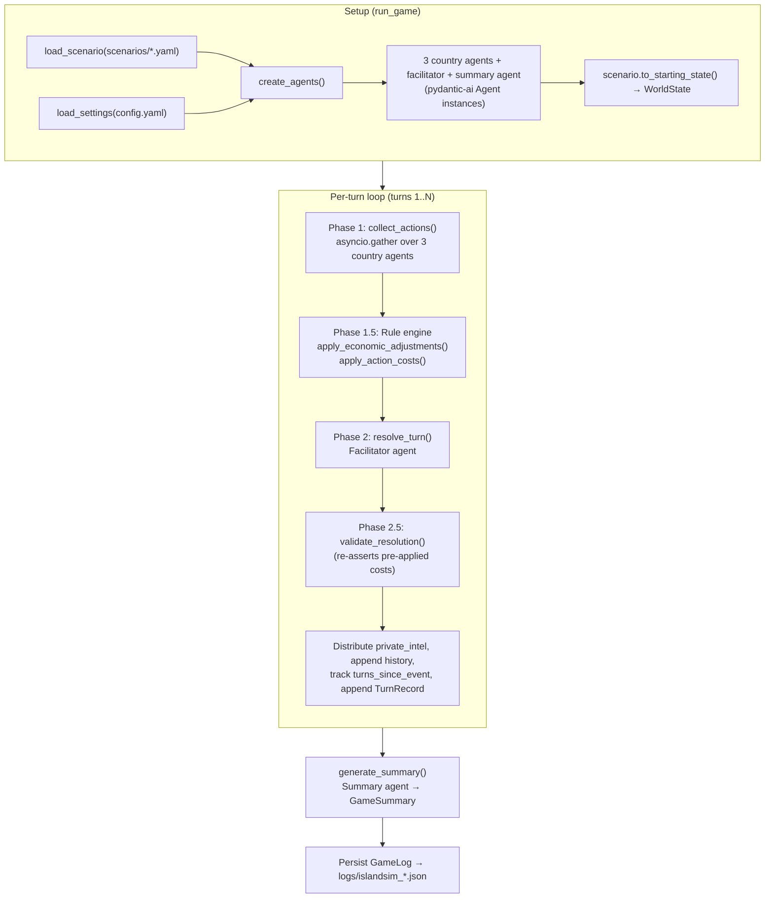
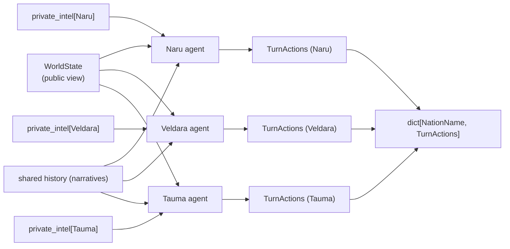
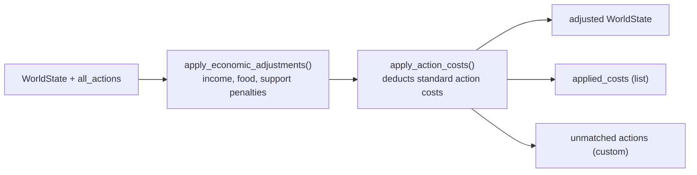
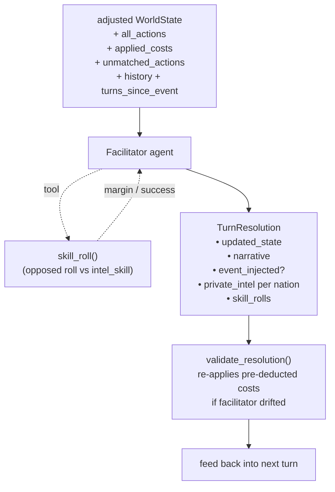
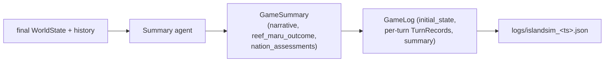

# Agentic Flow

How the IslandSim agents interact across a game run. Code references are in
`islandsim/game.py`, `islandsim/agents.py`, and `islandsim/rules.py`.

## High-level flow

## Phase 1 — country agents (concurrent)

Each country agent sees only its own private intel plus public world state,
and returns a structured `TurnActions` (typed pydantic-ai output).

Country agents classify each action with `StandardActionType` (or leave it
`None` for creative/custom actions). Costs for standard actions are
deterministic and applied by the rule engine, not the LLM.

## Phase 1.5 — rule engine

## Phase 2 — facilitator resolution

The facilitator receives the post-rule-engine state, is told which costs are
already applied, and only resolves unmatched/custom actions and narrative.
It can invoke the `skill_roll` tool (opposed roll against `intel_skill`)
for covert-action detection. Rolls are appended to `FacilitatorDeps.roll_log`
and surfaced on the returned resolution.

## End of game

 