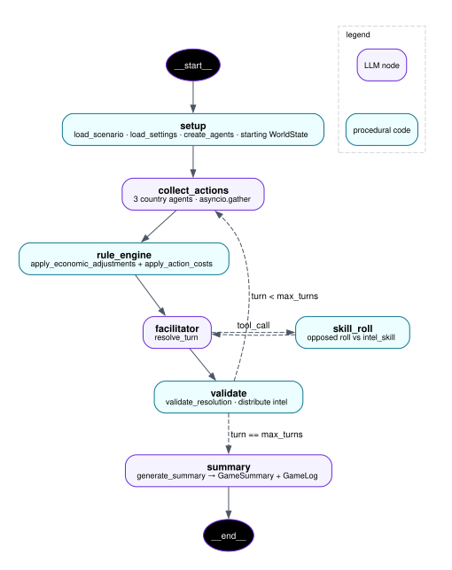

# Agentic Flow

 



Nodes:

- **collect_actions** — 3 country agents run concurrently via `asyncio.gather`, each returning a structured `TurnActions`.
- **rule_engine** — deterministic: `apply_economic_adjustments` + `apply_action_costs` on standard actions.
- **facilitator** — LLM resolution of the turn; emits a `list[StateChange]` (typed mutations with `reason` strings) rather than a full new `WorldState`.
- **skill_roll** — pydantic-ai tool the facilitator can invoke 0..n times for covert-action detection (opposed roll vs `intel_skill`).
- **apply_changes** — rule engine mechanically applies each `StateChange`, clamps resources, and writes the audit log.
- **summary** — terminal LLM pass producing `GameSummary`; the full `GameLog` is written to `logs/`.

The conditional edge out of **validate** loops back until `turn == max_turns`.

## Regenerating the diagram

Source is [`agent_flow.dot`](agent_flow.dot). Requires Graphviz (`brew install graphviz`):

```bash
dot -Tsvg docs/agent_flow.dot -o docs/agent_flow.svg
dot -Tpng -Gdpi=150 docs/agent_flow.dot -o docs/agent_flow.png
```
